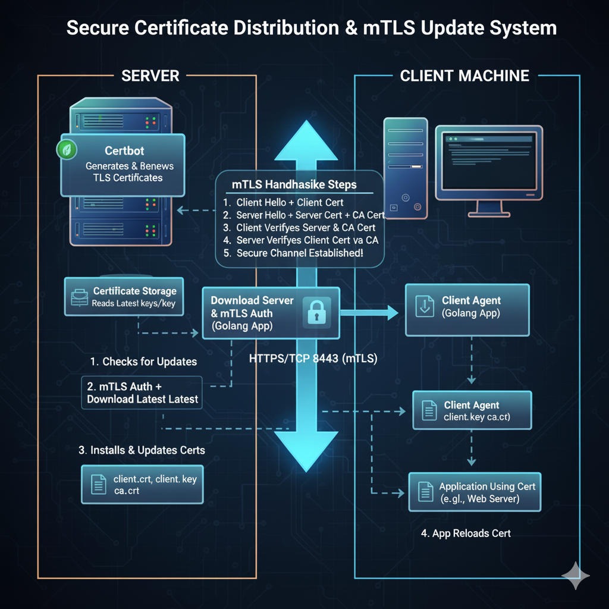

# ACME Certbot Centralized Certificate Management



## Architecture

Ce projet fournit un système robuste et sécurisé pour la gestion centralisée des certificats Certbot, basé sur Golang et protégé uniquement par mTLS. Il se compose de deux parties principales :

- **Serveur (Central de Distribution)** : Hébergé sur le serveur Certbot  qui génère et renouvelle les certificats,  expose une API sécurisée pour la distribution et la vérification des certificats.
- **Client (Agent de Mise à Jour)** : S'exécute sur les serveurs distants via cron ou à la demande, vérifie l'état des certificats locaux et les met à jour si nécessaire.

## Fonctionnalités

### Serveur

- **API `/api/check`** : Compare les hachages SHA256 des certificats envoyés par le client avec ceux du serveur. Si une différence est détectée, le serveur indique au client de procéder à la mise à jour.
- **Endpoint `/download/<domain>/<filename>`** : Permet le téléchargement direct des fichiers de certificats (`fullchain.pem`, `privkey.pem`, `chain.pem`) pour un domaine donné, protégé par mTLS.
- **Sécurité** : Toutes les communications sont protégées par mTLS. Aucune interface web listant les domaines n'est exposée.
- **Journalisation** : Toutes les erreurs et événements sont journalisés dans le syslog local avec la facilité `daemon` et la priorité `info`.

### Client

- **Vérification des certificats** : Calcule les hachages SHA256 des certificats locaux et les envoie au serveur pour vérification.
- **Mise à jour conditionnelle** : Si le serveur indique que les certificats ont changé, le client télécharge et remplace les fichiers locaux.
- **Exécution via cron** : Conçu pour être exécuté régulièrement (ex: chaque semaine) via une tâche cron, couplé a Make pour la relance des services.
- **Journalisation** : Toutes les erreurs et événements sont journalisés dans le syslog local avec la facilité `daemon` et la priorité `info`.

## Installation

### Prérequis

- Go 1.18+
- Certificats mTLS générés (CA, client, serveur)
- Certbot installé sur le serveur central
- Private PKI [docs/PKI.md](Check docs/PKI.md)

### Déploiement Serveur

1. Placez les certificats mTLS dans le dossier `tls/` :
    - `server.crt`, `server.key`, `ca.crt`
2. Compilez le serveur :

    ```sh
    cd server
    go build -o acme_dl_server main.go
    ```

3. Configurez le service systemd avec [server/acme_dl_server.service](server/acme_dl_server.service).
4. Vérifiez le lancement du serveur :

    ```sh
    # ps auxww | grep acme_dl_server
    ```

    Le serveur écoute sur le port `8443` (modifiable dans le code).

### Déploiement Client

1. Placez les certificats mTLS dans le dossier `tls/` :
    - `client.crt`, `client.key`, `ca.crt`
2. Compilez le client :

    ```sh
    cd client
    go build -o acme_dl_client client.go
    ```

3. Configurez une tâche cron hebdomadaire :

    ```sh
    0 3 * * 0 /path/to/acme_dl_client example.com
    ```

    Remplacez `example.com` par le nom du domaine à mettre à jour.

## Utilisation

### Client de téléchargement

```shell
./acme_dl_client <domain>
```

- `<domain>` : Nom du dossier dans `/etc/letsencrypt/live/` (ex: `example.com`).

### Serveur exposant les certificats

Le serveur démarre et expose les endpoints :

- `POST /api/check` : Vérification des certificats
- `GET /download/<domain>/<filename>` : Téléchargement direct des fichiers

## Sécurité

- **Authentification** : mTLS obligatoire pour tous les endpoints.
- **Pas d'interface web listant les domaines**.
- **Renouvellement des certificats** : Géré par Certbot via cron ou script externe, non inclus dans le serveur Golang.

## Journalisation

Toutes les erreurs et événements sont envoyés au syslog local (`daemon.info`) grâce à la bibliothèque standard `log/syslog`.

## Structure des dossiers

```shell
.
├── client/
│   └── client.go
├── server/
│   ├── main.go
│   └── acme_dl_server.service
├── tls/
│   ├── ca.crt
│   ├── client.crt
│   ├── client.key
│   ├── server.crt
│   └── server.key

Sur les serveurs Certbot et autres : 

└── /etc/letsencrypt/live/<domain>/
    ├── fullchain.pem
    ├── privkey.pem
    └── chain.pem
```

## Liens utiles

- [client/client.go](client/client.go)
- [server/main.go](server/main.go)
- [server/acme_dl_server.service](server/acme_dl_server.service)

---

Pour toute question ou amélioration, contactez l'équipe DevOps.
