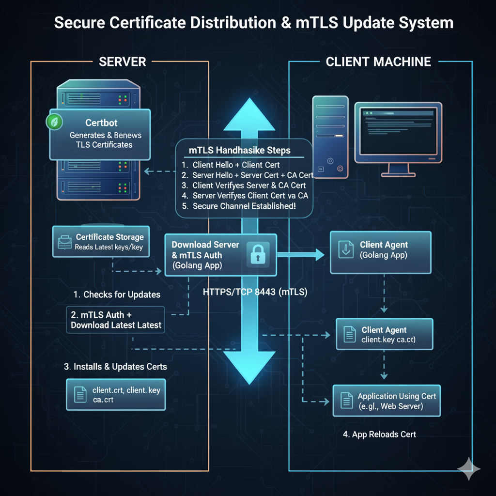

# ACME Certbot Centralized Certificate Management



## Architecture

This project provides a robust and secure system for centralized management of Certbot certificates, built in Golang and protected exclusively by mTLS. It consists of two main components:

- **Server (Distribution Center)**: Hosted on the Certbot server that generates and renews certificates, exposes a secure API for certificate distribution and verification.
- **Client (Update Agent)**: Runs on remote servers via cron or on demand, checks the status of local certificates and updates them if necessary.

## Features

### Server

- **API `/api/check`**: Compares the SHA256 hashes of certificates sent by the client with those on the server. If a difference is detected, the server instructs the client to proceed with the update.
- **Endpoint `/download/<domain>/<filename>`**: Allows direct download of certificate files (`fullchain.pem`, `privkey.pem`, `chain.pem`) for a given domain, protected by mTLS.
- **Security**: All communications are protected by mTLS. No web interface listing domains is exposed.
- **Logging**: All errors and events are logged to the local syslog with the `daemon` facility and `info` priority.

### Client

- **Certificate verification**: Calculates SHA256 hashes of local certificates and sends them to the server for verification.
- **Conditional update**: If the server indicates that certificates have changed, the client downloads and replaces the local files.
- **Execution via cron**: Designed to be run regularly (e.g., weekly) via a cron job, coupled with Make for service restarts.
- **Logging**: All errors and events are logged to the local syslog with the `daemon` facility and `info` priority.

## Installation

### Prerequisites

- Go 1.18+
- Generated mTLS certificates (CA, client, server)
- Certbot installed on the central server
- Private PKI [docs/PKI.md](Check docs/PKI.md)

### Server Deployment

1. Place the mTLS certificates in the `tls/` folder:
    - `server.crt`, `server.key`, `ca.crt`
2. Build the server:

    ```sh
    cd server
    go build -o acme_dl_server main.go
    ```

3. Configure the systemd service with [server/acme_dl_server.service](server/acme_dl_server.service).
4. Check that the server is running:

    ```sh
    # ps -auxww | grep acme_dl_server
    ```

    The server listens on port `8443` (modifiable in the code).

### Client Deployment

1. Place the mTLS certificates in the `tls/` folder:
    - `client.crt`, `client.key`, `ca.crt`
2. Build the client:

    ```sh
    cd client
    go build -o acme_dl_client client.go
    ```

3. Set up a weekly cron job:

    ```sh
    0 3 * * 0 /path/to/acme_dl_client example.com
    ```

    Replace `example.com` with the domain name to update.

## Usage

### Download Client

```sh
./acme_dl_client <domain>
```

- `<domain>`: Name of the folder in `/etc/letsencrypt/live/` (e.g., `example.com`).

### Server exposing certificates

The server starts and exposes the following endpoints:

- `POST /api/check`: Certificate verification
- `GET /download/<domain>/<filename>`: Direct file download

## Security

- **Authentication**: mTLS is required for all endpoints.
- **No web interface listing domains**.
- **Certificate renewal**: Managed by Certbot via cron or external script, not included in the Golang server.

## Logging

All errors and events are sent to the local syslog (`daemon.info`) using the standard `log/syslog` library.

## Folder Structure

```shell
.
├── client/
│   └── client.go
├── server/
│   ├── main.go
│   └── acme_dl_server.service
├── tls/
│   ├── ca.crt
│   ├── client.crt
│   ├── client.key
│   ├── server.crt
│   └── server.key

On Certbot and other servers:

└── /etc/letsencrypt/live/<domain>/
    ├── fullchain.pem
    ├── privkey.pem
    └── chain.pem
```

## Useful Links

- [client/client.go](client/client.go)
- [server/main.go](server/main.go)
- [server/acme_dl_server.service](server/acme_dl_server.service)

---

For any questions or improvements, contact the DevOps team.
